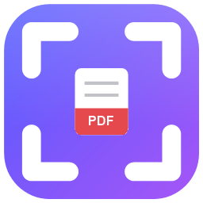

# Recorto



Capturá una región de la pantalla y guardala como **PDF**, PNG o JPG.
Portable de verdad: una carpeta que copiás a un pendrive y anda. No instala
nada, no toca el registro, no usa .NET.

Probado en Windows 10 x64. Compilado para correr desde **Windows 7 SP1** (32 y
64 bits) en adelante.

---

## Cómo se usa

1. Ejecutás `recorto.exe`. Queda residente con un ícono en la bandeja y abre el
   modo recorte de una.
2. **F8** (configurable) abre el modo recorte en cualquier momento.
3. La pantalla se congela y se oscurece. Arrastrás con el botón izquierdo: la
   región elegida se ve a opacidad plena, con un borde de 1 px y el tamaño en
   vivo al lado del cursor (`842 × 391`).
4. Al soltar aparece el diálogo de guardado, con **PDF** preseleccionado.
5. **ESC** o clic derecho cancela. Un clic sin arrastre (menos de 5×5 px)
   también.

### Ícono anclado a la barra de tareas

Anclá `recorto.exe` a la barra de tareas: al hacerle clic abre el modo recorte
directamente, sin levantar una segunda copia del programa. La segunda ejecución
detecta a la que ya está corriendo, le manda un mensaje y se cierra sola.

Funciona incluso mezclando el `.exe` de 32 bits con el de 64 bits: comparten el
mismo mutex y la misma ventana-buzón.

### Menú de bandeja

| Opción | Qué hace |
|---|---|
| Recortar ahora | Abre el modo recorte (también con un solo clic en el ícono) |
| Abrir carpeta de salida | Explorador en la última carpeta usada |
| Configuración | Abre `config.ini` en el Notepad |
| Salir | Cierra Recorto |

### Argumentos de línea de comandos

| Argumento | Efecto |
|---|---|
| *(ninguno)* | Arranca residente **y** abre el recorte de una |
| `/tray` | Arranca residente y callado. Útil para la carpeta de Inicio |
| `/snip` | Fuerza el comportamiento por defecto |

---

## Estructura de la carpeta

```
recorto/
├─ recorto.exe            el programa (32 bits: anda en Win7 x86 y x64)
├─ recorto_x64.exe        versión de 64 bits (opcional, misma funcionalidad)
├─ config.ini             configuración; se crea sola en el primer arranque
├─ magick.exe             OPCIONAL - ver "ImageMagick" más abajo
│
├─ recorto.ahk            fuente principal, comentada
├─ Gdip_All.ahk           librería GDI+ para AHK v1.1
├─ recorto.ico            ícono, se embebe al compilar
├─ config.ejemplo.ini     copia de referencia del config.ini
├─ build.cmd              compila los dos .exe
└─ docs/icono.png         el ícono
```

Para usarla en un pendrive alcanza con `recorto.exe`. `config.ini` se crea solo
al lado del ejecutable en el primer arranque.

---

## Formatos de salida

| Formato | Cómo se genera |
|---|---|
| **PNG** | La captura se escribe a un PNG temporal en `%TEMP%` y se mueve al destino. Sin conversión. |
| **JPG** | `magick -quality 92` si `magick.exe` está en la carpeta. Si no, el codificador JPEG de GDI+ con la misma calidad. |
| **PDF** | `magick -units PixelsPerInch -density 96` si `magick.exe` está. Si no, el generador de PDF interno. |

El temporal se borra siempre, aunque la conversión falle. Si cancelás el
diálogo de guardado no queda nada.

La densidad del PDF (96 DPI por defecto) hace que la página tenga el tamaño
físico real que el recorte tenía en pantalla: un recorte de 641×361 px sale como
una página de 480,75 × 270,75 puntos. Los dos motores producen exactamente el
mismo `MediaBox`.

### El generador de PDF interno

No hace falta ninguna librería de compresión, que Windows 7 no trae. El truco es
que los chunks `IDAT` de un PNG **ya son** un stream zlib con los predictores de
PNG aplicados, y eso es exactamente lo que PDF acepta como `/FlateDecode` con
`/Predictor 15`. Así que los bytes del PNG temporal se pegan dentro del PDF tal
cual, sin descomprimir ni recomprimir. Resultado: sin pérdida, instantáneo y sin
dependencias.

---

## ImageMagick (opcional)

**Recorto anda perfecto sin ImageMagick.** Está soportado porque da más control
sobre la conversión, pero no hace falta para nada.

### Cuidado en Windows 7

Los binarios oficiales de ImageMagick para Windows **ya no arrancan en Windows
7**. La página de descarga lo dice ("ImageMagick runs on Windows 10 or newer"), y
mirando el ejecutable se confirma: `magick.exe` importa de forma **estática**
`api-ms-win-core-synch-l1-2-0.dll`, que no existe en Windows 7, más
`VCOMP140.DLL`, que viene con el redistribuible de Visual C++ y no está incluido
en el paquete "portable". Lo verifiqué contra la versión 7.1.2-30 y también
contra ImageMagick 6.9.13-50: las dos tienen el mismo problema.

**En Windows 7: no pongas `magick.exe` en la carpeta.** Recorto genera el PDF y
el JPG por su cuenta.

### Si igual lo querés (Windows 10/11)

Bajá el paquete **portable**, que es un `.7z` sin instalador ni entradas de
registro:

- 64 bits: [`ImageMagick-7.1.2-30-portable-Q16-x64.7z`](https://github.com/ImageMagick/ImageMagick/releases/download/7.1.2-30/ImageMagick-7.1.2-30-portable-Q16-x64.7z)
- 32 bits: [`ImageMagick-7.1.2-30-portable-Q16-x86.7z`](https://github.com/ImageMagick/ImageMagick/releases/download/7.1.2-30/ImageMagick-7.1.2-30-portable-Q16-x86.7z)

Los últimos están siempre en
[github.com/ImageMagick/ImageMagick/releases](https://github.com/ImageMagick/ImageMagick/releases)
(sección *Assets*, los archivos con `portable` en el nombre). Del `.7z` sacá
**sólo `magick.exe`** y ponelo al lado de `recorto.exe`. Son unos 25 MB y trae
todo adentro; el resto de los `.exe` del paquete no se usan.

`Q16` es la variante recomendada (16 bits por componente). `Q8` también sirve y
pesa menos. Evitá `HDRI` salvo que lo necesites para otra cosa.

Si al probarlo salta *"falta VCOMP140.DLL"*, copiá ese archivo desde
`C:\Windows\System32` (versión de 64 bits) o `C:\Windows\SysWOW64` (32 bits) al
lado de `magick.exe`, o instalá el redistribuible de Visual C++ 2015-2022. Si no
querés lidiar con eso, dejá `PdfEngine=auto` sin `magick.exe`: el resultado es
el mismo.

Recorto busca `magick.exe` en este orden: la carpeta del ejecutable,
`imagemagick\`, `ImageMagick\`, `bin\`, y por último el `PATH`.

---

## config.ini

Se crea solo en el primer arranque, al lado del ejecutable, en **UTF-16 LE**
(así las rutas con acentos no se rompen). Si lo borrás se vuelve a crear.
Los cambios se aplican al reiniciar Recorto.

| Clave | Por defecto | Qué hace |
|---|---|---|
| `Hotkey` | `F8` | Hotkey global. Sintaxis de AutoHotkey: `^`=Ctrl `!`=Alt `+`=Shift `#`=Win. Ej: `^!s`, `#PrintScreen` |
| `DefaultFormat` | `pdf` | Filtro preseleccionado en el diálogo: `pdf`, `png` o `jpg` |
| `JpgQuality` | `92` | Calidad JPG, 1-100 |
| `PdfDensity` | `96` | DPI del PDF. Más alto = página más chica |
| `InitialDir` | *(vacío)* | Carpeta del diálogo. Recorto la actualiza sola con la última usada |
| `OverlayOpacity` | `45` | Oscurecimiento del overlay, 0-95 (%) |
| `PdfEngine` | `auto` | `auto` = magick si está, si no el interno · `magick` = exige magick.exe · `interno` = ignora magick.exe |
| `DpiAware` | `1` | Declarar el proceso DPI-aware. Ponelo en `0` sólo si con escalado de pantalla el recorte te queda corrido |

Si una clave tiene un valor inválido, Recorto usa el valor por defecto en vez de
romperse. Si el hotkey no es válido avisa y cae a F8.

---

## Compilar

Necesitás **AutoHotkey 1.1** (no v2), edición Unicode. Podés bajar el zip
portable de [autohotkey.com/download/ahk.zip](https://www.autohotkey.com/download/ahk.zip)
y descomprimirlo donde quieras: trae `Ahk2Exe.exe` en la carpeta `Compiler`.

Con `build.cmd`:

```bat
build.cmd "C:\ruta\a\AutoHotkey\Compiler"
```

O a mano:

```bat
Ahk2Exe.exe /in recorto.ahk /out recorto.exe     /base "Unicode 32-bit.bin" /silent
Ahk2Exe.exe /in recorto.ahk /out recorto_x64.exe /base "Unicode 64-bit.bin" /silent
```

El ícono se embebe solo: el script trae la directiva
`;@Ahk2Exe-SetMainIcon recorto.ico`, junto con el nombre, la versión y la
descripción del ejecutable. Requiere Ahk2Exe 1.1.33 o superior.

**El de 32 bits es el que conviene distribuir:** anda igual en Windows de 32 y
de 64 bits. El de 64 bits está sólo por si lo preferís.

Para correrlo sin compilar, ejecutá `recorto.ahk` con `AutoHotkeyU32.exe` o
`AutoHotkeyU64.exe`. En ese caso el ícono de la bandeja sale de `recorto.ico`,
que tiene que estar en la misma carpeta.

> `recorto.ahk` está guardado en **UTF-8 con BOM**. Si lo editás, guardalo así:
> sin el BOM, AutoHotkey lo lee como ANSI y los acentos y el `×` de la etiqueta
> salen mal.

---

## Detalles de implementación

**Multi-monitor.** El overlay cubre el escritorio virtual completo, calculado
con `SM_XVIRTUALSCREEN`/`SM_YVIRTUALSCREEN` (76 y 77), que son negativos si hay
monitores a la izquierda o arriba del principal. Todas las coordenadas se
manejan en ese espacio y se traducen al buffer restando el origen.

**Sin parpadeo.** Cada frame se compone entero en un DIB de 32 bits y se publica
con un único `UpdateLayeredWindow`. El fondo oscurecido se pre-renderiza una vez
al abrir el overlay y se pone en cada frame con un `BitBlt`, que es una copia de
memoria; sólo la región seleccionada, las guías y la etiqueta pasan por GDI+.

**Sin fugas de GDI.** `DestroyOverlay()` libera todo lo que creó `StartSnip()`:
los dos DC de memoria con sus bitmaps (devolviendo primero el bitmap original al
DC), el `pBitmap` de la captura y la ventana. Se llama tanto al cancelar como al
confirmar. Los pens y brushes se crean y destruyen dentro del mismo frame.

**Cursor de cruz.** Se responde `WM_SETCURSOR` con `IDC_CROSS` en vez de usar
`SetSystemCursor`, que cambia estado global de Windows y hay que restaurar sí o
sí.

**Diálogo de guardado.** Se llama `GetSaveFileNameW` directo, porque el comando
`FileSelectFile` de AutoHotkey sólo admite un filtro. Los offsets de
`OPENFILENAMEW` están escritos a mano para 32 y 64 bits (el alineado de los
punteros cambia). Verificado en las dos arquitecturas: los tres filtros salen en
orden, con PDF preseleccionado.

**Extensión.** El diálogo no completa la extensión solo (`lpstrDefExt` va en
cero), porque agregaría siempre la misma sin mirar el filtro elegido. Se resuelve
al volver: si el nombre tipeado ya trae `.pdf`, `.png`, `.jpg` o `.jpeg`, gana
esa; si no, se agrega la del filtro y se pregunta antes de sobrescribir.

**Instancia única.** No se usa `#SingleInstance Ignore`: con esa directiva
AutoHotkey mata a la segunda instancia *antes* de ejecutar la primera línea del
script, así que nunca llegaría a avisarle a la primera. En su lugar hay un mutex
con nombre (`Local\Recorto_SingleInstance_7A31`) que decide quién es la instancia
principal, y una ventana-buzón oculta que recibe un mensaje registrado con
`RegisterWindowMessage`. El comportamiento visible es idéntico al de `Ignore`,
más el aviso.

**DPI.** Al arrancar se prueba `SetProcessDpiAwarenessContext` (Win10 1703+),
después `SetProcessDpiAwareness` (Win8.1+) y por último `SetProcessDPIAware`
(Vista+), comprobando antes que la función exista. En Windows 7 cae en la
última. Sin esto, con escalado al 125% la captura sale borrosa y corrida.

**Rutas.** Todo lo que se le pasa a `magick.exe` va entre comillas, así las
rutas con espacios y acentos pasan sin romperse.

---

## Licencia

MIT. Ver [LICENSE](LICENSE).

`Gdip_All.ahk` es la
[compilación de la librería GDI+ para AutoHotkey](https://github.com/marius-sucan/AHK-GDIp-Library-Compilation)
de Marius Șucan, a su vez basada en el trabajo original de Tariq Porter
(licencia MIT).
